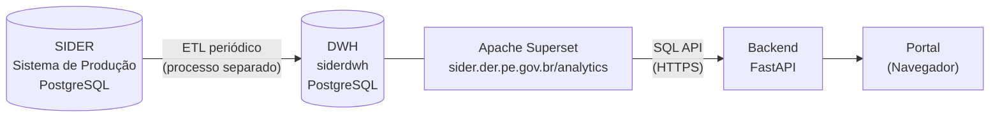
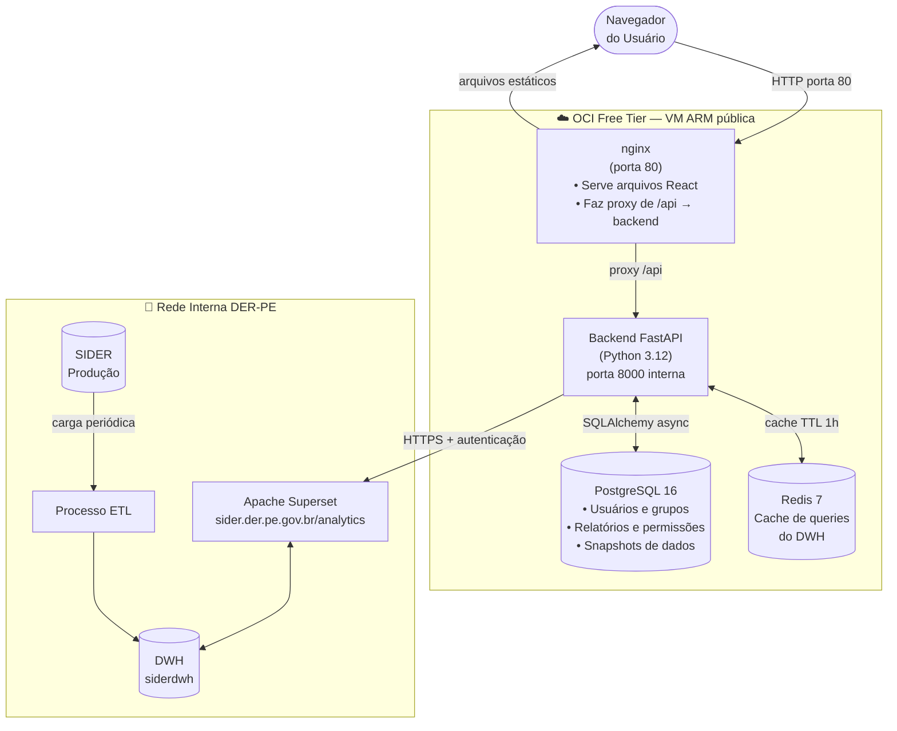
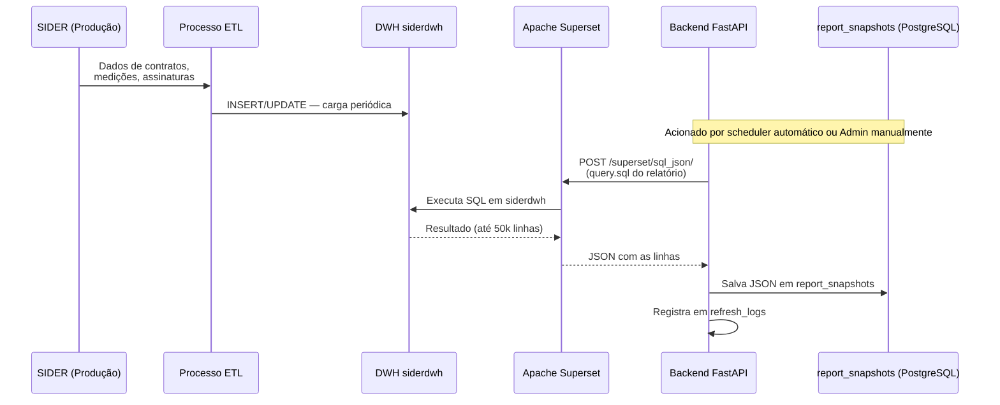
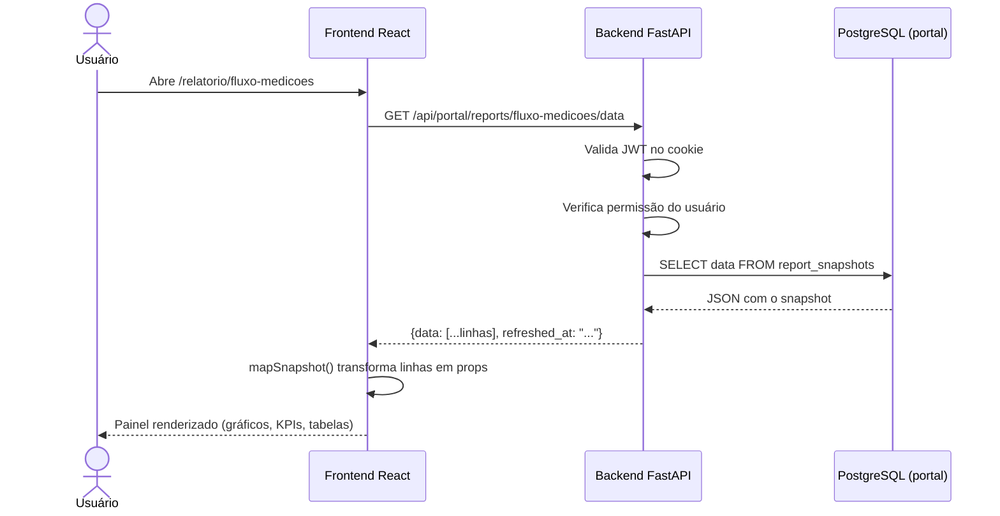
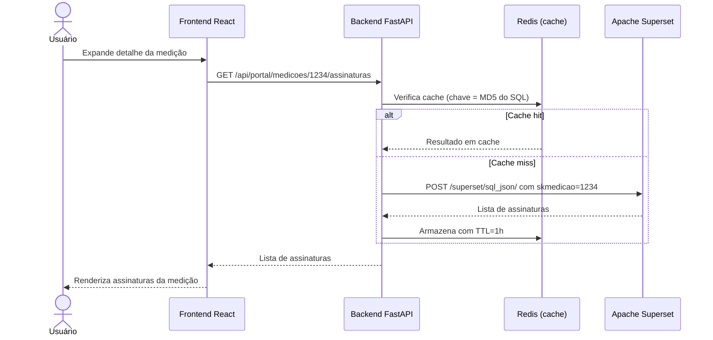
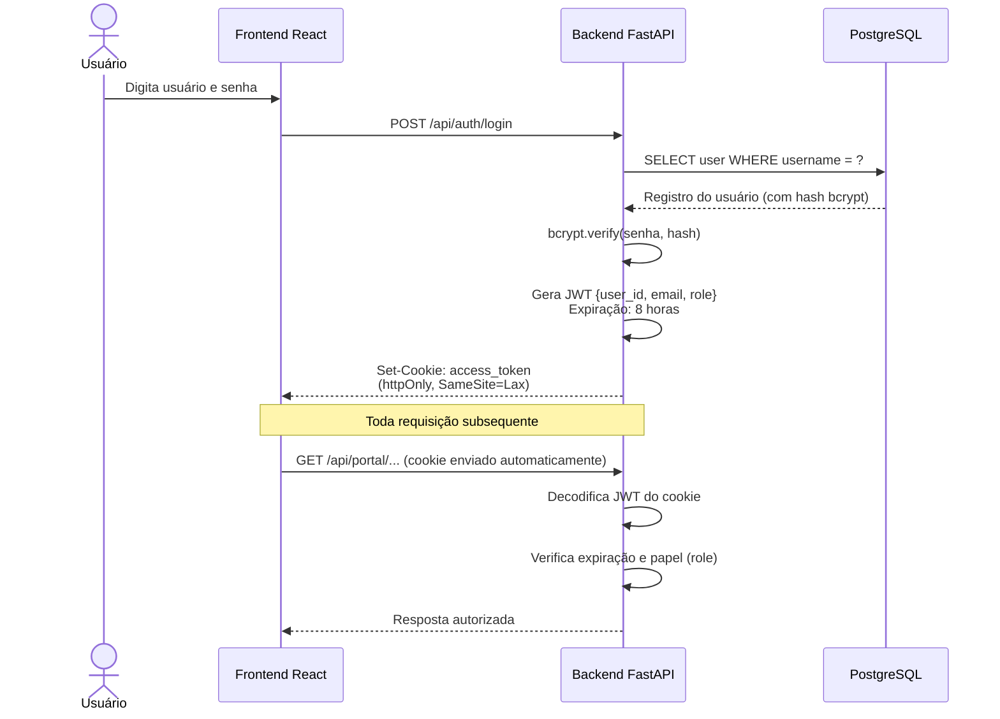
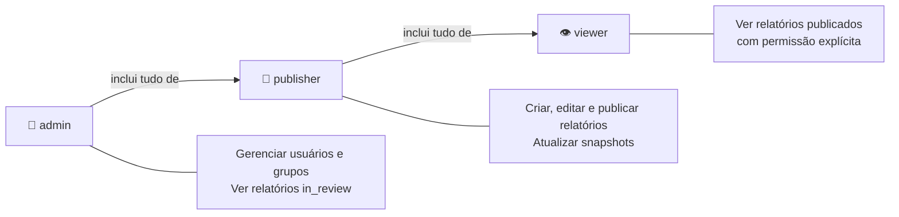
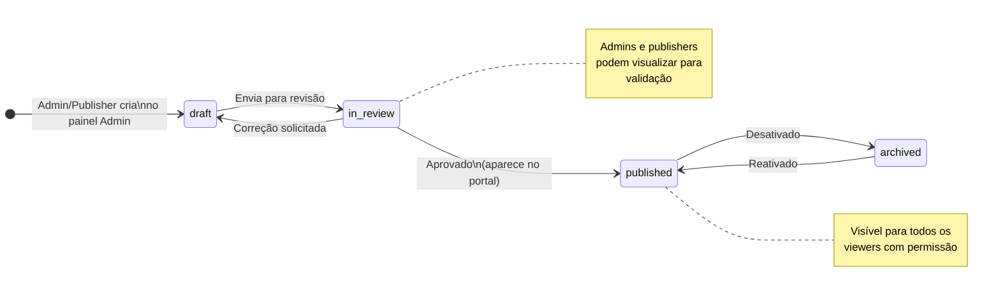
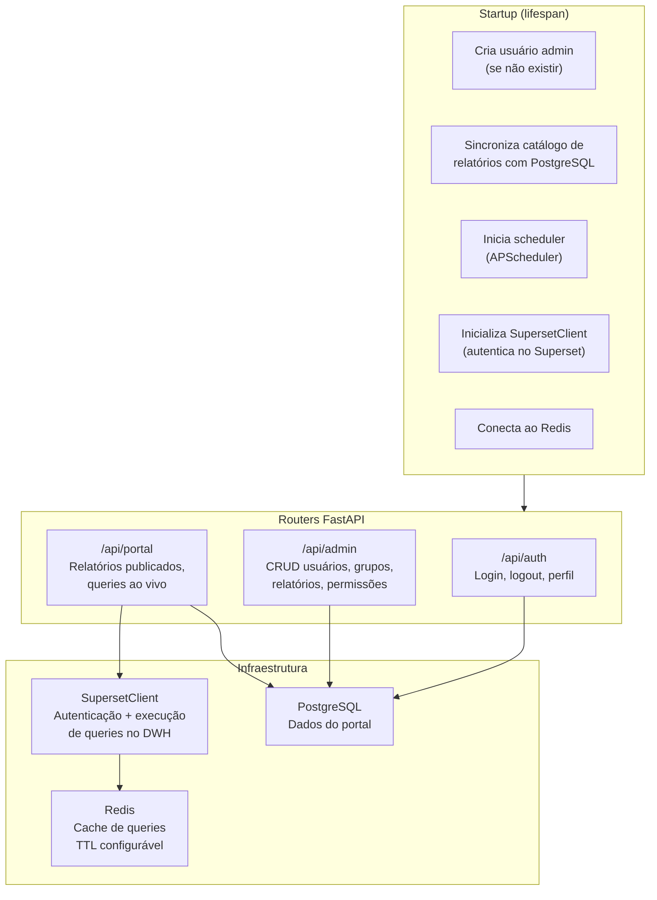

# Portal BI DER-PE — Visão Geral do Sistema

**Público-alvo:** Qualquer pessoa nova na equipe que precisa entender como o sistema funciona, de onde vêm os dados e onde tudo está hospedado — sem precisar ler código.

---

## 1. O que é o Portal BI

O **Portal BI** é uma aplicação web interna da **DER-PE** (Departamento de Estradas de Rodagem de Pernambuco) que centraliza relatórios e painéis de acompanhamento de **contratos, medições e pagamentos** de obras rodoviárias.

Antes do portal, informações sobre o andamento de medições precisavam ser extraídas manualmente do sistema de gestão ou consultadas diretamente no banco de dados — processo lento e sujeito a erros. O portal automatiza esse ciclo: coleta dados do sistema de produção, armazena snapshots otimizados e os exibe em painéis interativos.

**Quem usa:**
| Perfil | O que faz no portal |
|---|---|
| Gestores de contrato | Acompanham andamento de medições e pagamentos |
| Fiscais de campo | Consultam status de assinaturas e etapas da jornada |
| Administradores | Gerenciam usuários, publicam relatórios, monitoram atualizações |

---

## 2. De onde vêm os dados

Os dados percorrem quatro camadas antes de aparecerem no portal:

### SIDER — Sistema de Produção

O **SIDER** é o sistema de gestão operacional da DER-PE. É onde tudo nasce: contratos firmados, medições lançadas, assinaturas registradas, notas fiscais emitidas. Roda em banco PostgreSQL dentro da rede interna da DER-PE.

### ETL — Extração e Carga no DWH

Um processo ETL (Extract, Transform, Load) roda periodicamente e extrai dados do SIDER, aplica transformações e os carrega no DWH (Data Warehouse). Esse processo é **gerenciado em repositório separado** — qualquer problema com a origem dos dados ou com colunas faltando começa aqui.

> O código do ETL está em repositório GitLab dedicado, mantido pela equipe de BI da Softplan.

### DWH — Data Warehouse (`siderdwh`)

O DWH é um banco PostgreSQL analítico com schema `siderdwh`. Organizado no modelo **fato-dimensão**:

| Prefixo | Tipo | Exemplo | Contém |
|---|---|---|---|
| `ebisf*` | Fato | `ebisfmedicaocontrato` | Dados transacionais, chaves (`sk*`), flags |
| `ebisd*` | Dimensão | `ebisdcontrato` | Atributos desnormalizados, descrições, títulos |

O portal **nunca escreve no DWH** — acesso é somente-leitura via Superset.

### Apache Superset — Gateway de Acesso ao DWH

O [Superset](https://sider.der.pe.gov.br/analytics) é a ferramenta de BI da DER-PE que o portal usa como **gateway** para o DWH. O backend autentica-se no Superset como usuário de serviço e envia queries SQL via a API interna do Superset (`POST /superset/sql_json/`).

> **Por que usar o Superset como intermediário?** O banco do DWH só é acessível através do Superset dentro da infraestrutura da DER-PE. O portal não tem acesso direto ao PostgreSQL do DWH — essa camada de indireção é intencional.

---

## 3. Arquitetura do Sistema

**Conectividade OCI ↔ DER-PE:**
- O backend conecta-se ao Superset via HTTPS pela internet pública
- O IP do Superset (`136.248.126.29`) é resolvido via `extra_hosts` no Docker Compose
- Em desenvolvimento, os DNS internos da DER-PE (`192.168.100.x`) são configurados nos contêineres para resolução de nomes internos

---

## 4. Fluxo de Dados Ponta a Ponta

### 4.1 Atualização dos dados (como os dados chegam ao portal)

### 4.2 Consulta pelo usuário (como o usuário vê os dados)

> O snapshot elimina latência: o usuário recebe dados do **PostgreSQL local** (milissegundos), não do DWH externo. O DWH só é consultado durante a atualização periódica, não a cada visita.

### 4.3 Query ao vivo (dados com parâmetros dinâmicos)

Para dados que **precisam de parâmetros** (ex: assinaturas de uma medição específica), o backend consulta o Superset em tempo real — sem snapshot intermediário.

---

## 5. Onde Está Hospedado

| Componente | Desenvolvimento | Produção |
|---|---|---|
| Toda a aplicação | Docker Compose local | OCI Free Tier — VM ARM |
| Acesso externo | `localhost:8081` | IP público da OCI, porta 80 |
| Frontend (React) | Build em `dist/` servido por nginx | Idem |
| Backend (FastAPI) | Porta 8000 (interna) | Idem |
| PostgreSQL | Porta 5432 (interna) | Idem, volume persistente |
| Redis | Porta 6379 (interna) | Idem |
| DWH / Superset | `sider.der.pe.gov.br` (rede DER-PE) | Idem — externo ao portal |

**OCI Free Tier:**
- Instância ARM Ampere A1 — **4 OCPUs e 24 GB de RAM gratuitos**
- Toda a aplicação roda via Docker Compose com arquivo de override (`docker-compose.prod.yml`)
- Em produção não há volume de código local — a imagem buildada é usada diretamente

---

## 6. Fluxo de Autenticação

**Segurança do token:**
- Cookie `httpOnly` — JavaScript no browser não consegue ler o token (proteção contra XSS)
- `SameSite=Lax` — protege contra CSRF
- Em caso de 401, o frontend redireciona automaticamente para `/login`
- Senha inicial marcada com `must_change_password=true` — usuário é forçado a trocar antes de acessar o portal

---

## 7. Papéis de Usuário

| Papel | Acesso ao portal | Painel admin | Gerenciar usuários | Ver rascunhos |
|---|:---:|:---:|:---:|:---:|
| `admin` | ✅ | ✅ | ✅ | ✅ |
| `publisher` | ✅ | ✅ (parcial) | ❌ | ✅ |
| `viewer` | ✅ (limitado) | ❌ | ❌ | ❌ |

**Permissão por relatório:**
- Um `viewer` só vê relatórios para os quais tem permissão explícita — por usuário individual ou por pertencer a um grupo com acesso.
- `admin` e `publisher` veem todos os relatórios publicados automaticamente.

---

## 8. Ciclo de Vida de um Relatório

**Etapas resumidas:**
1. **draft** — Relatório criado, configurado com título, capa, SQL query e permissões
2. **in_review** — Enviado para revisão; admins e publishers validam os dados
3. **published** — Disponível no portal para os viewers autorizados
4. **archived** — Desativado; não aparece no portal mas os dados são preservados

---

## 9. Componentes Internos do Backend

